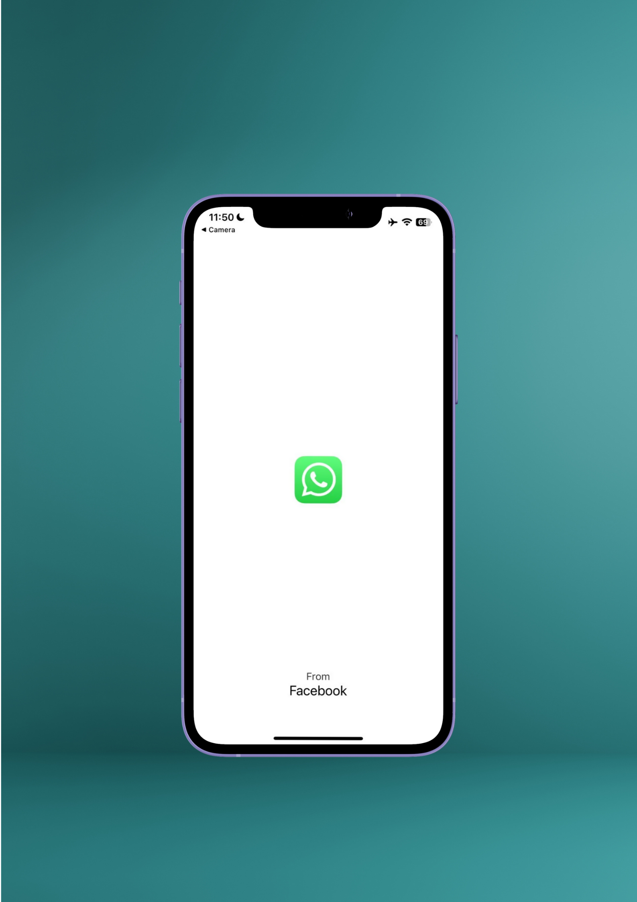
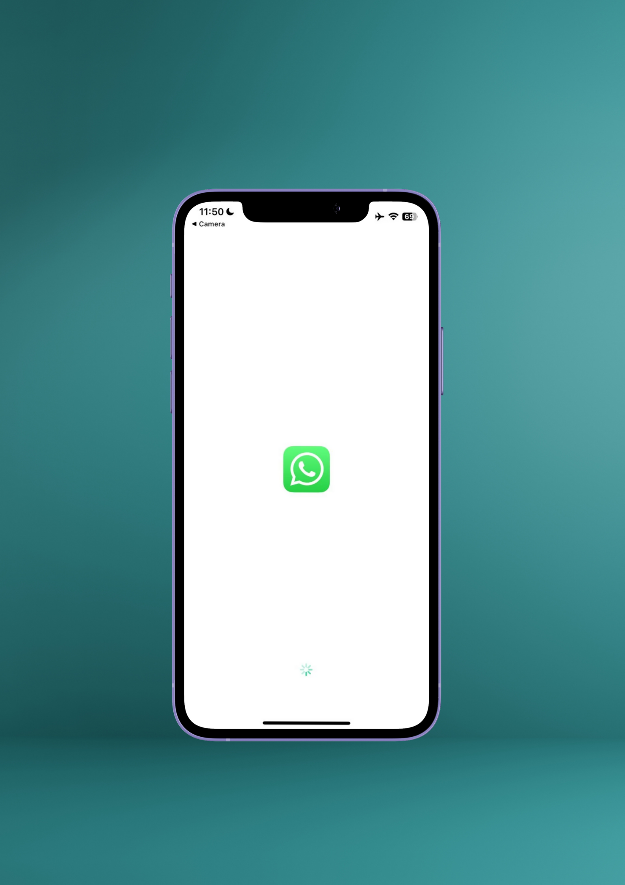
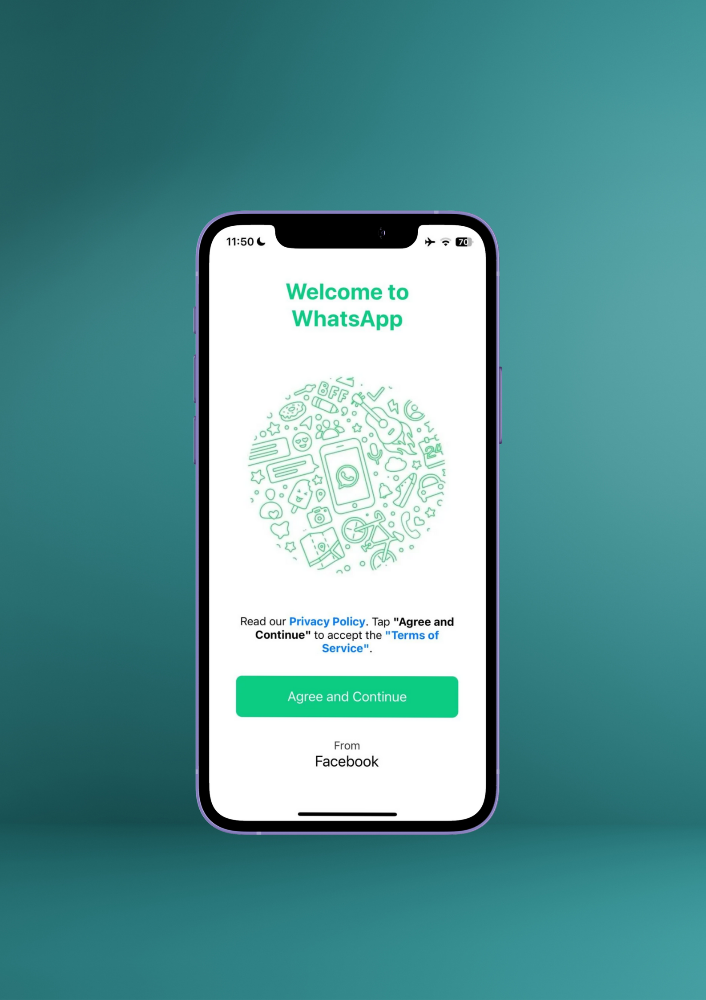
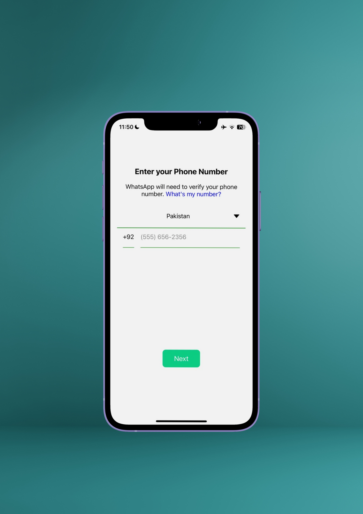
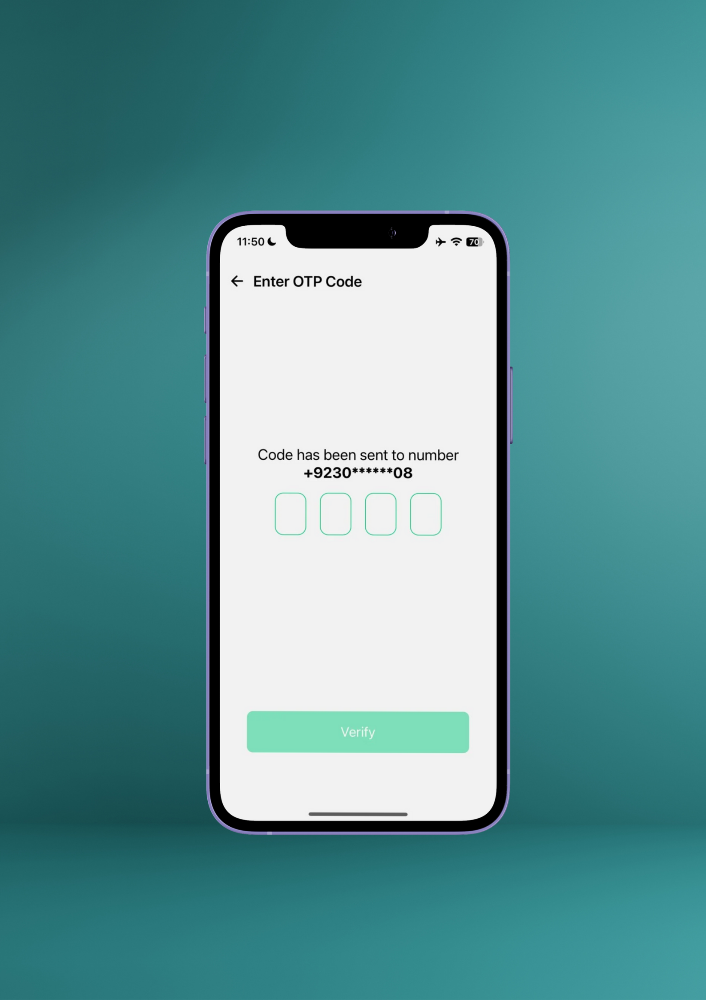
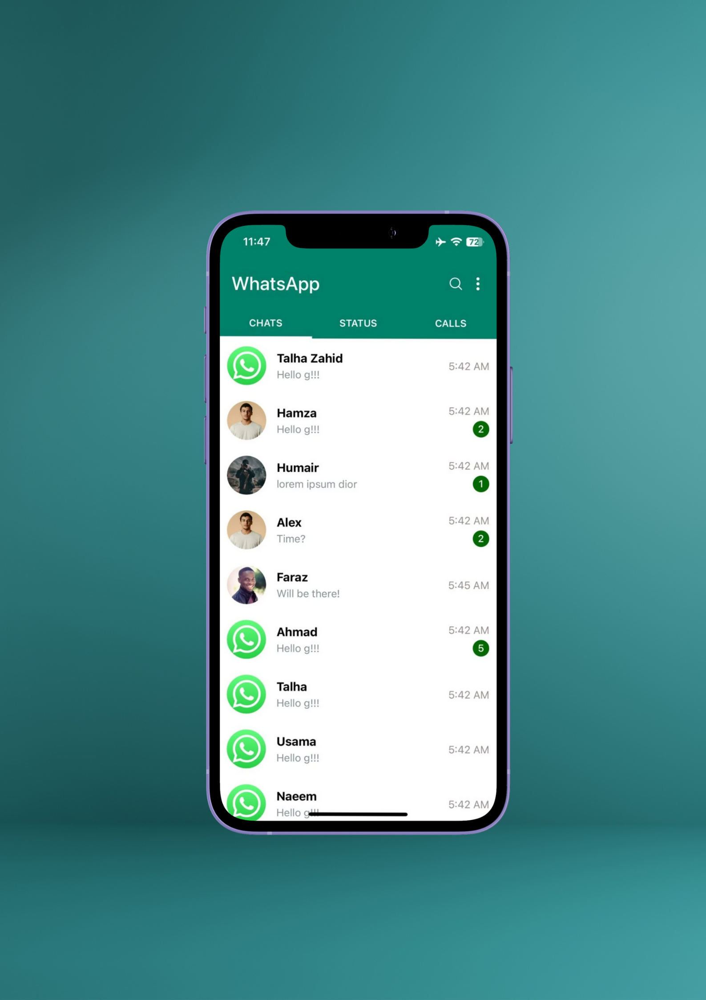
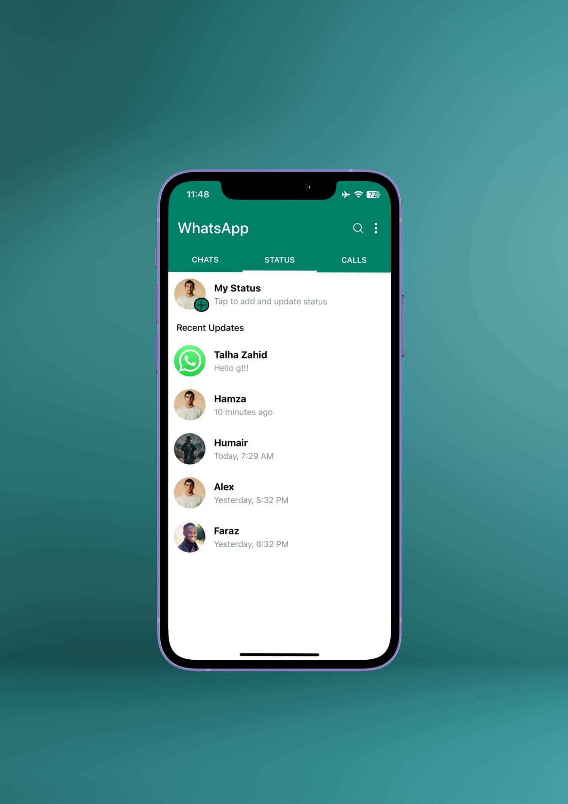
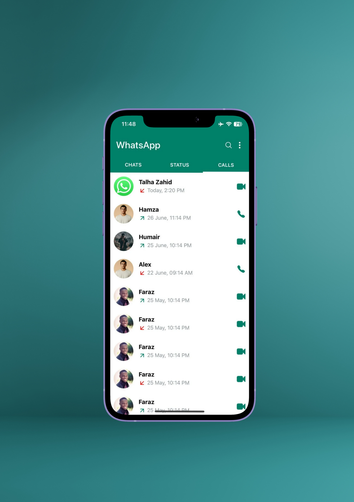

```markdown
# 📱 WhatsApp Clone (Classic UI)

A UI-only clone of the classic WhatsApp app built using **React Native**, **Expo**, and **TypeScript**. This project mimics the old WhatsApp layout for **chats**, **status**, **calls**, and **authentication flow**. Fully responsive across Android and iOS platforms.

> ⚠️ This is a **frontend-only build** – no backend or real-time database integration is included yet.

---

## ✨ Features

- 🟢 Classic WhatsApp UI
- 📥 Splash screen with app icon and loading animation
- 🙋 Welcome screen with privacy policy prompt
- ☎️ Phone number entry and OTP input (UI only)
- 🗨️ Chat list with message preview, unread badge, time
- 📸 Status screen with recent updates
- 📞 Calls tab with incoming/outgoing/missed call indicators

---

## 📸 Screenshots

> Images are stored in the `/Screenshots` folder.

## 📸 Screenshots

> Images are stored in the `/Screenshots` folder.

| Splash Screen              | Activity Indicator Animation |
|----------------------------|------------------------------|
|  |  |

| Welcome Screen            | Phone Input                 | OTP Screen                |
|---------------------------|------------------------------|----------------------------|
|  |  |  |

| Chats Tab                 | Status Tab                  |
|---------------------------|------------------------------|
|  |  |

| Calls Tab                |
|--------------------------|
|  |


---

## 🧱 Folder Structure


src/
├── app/
│   ├── (auth)/              # Screens: splash, Welcome, Phone, OTP
│   ├── (main)/              # Screens: Main Screen
│   └── \_layout.tsx          # Expo Router config
├── assets/                  # App icons, images
├── components/
│   ├── atom/                # Custom Status Bar
│   └── molecule/            # Screens:Calls,Chats,Status,Message Card
├── constants/               # Logo,Pics

````

---

## 🛠 Tech Stack

- **React Native (Expo)**
- **TypeScript**
- **Expo Router**
- **Atomic Design pattern**

---

## 🚀 Getting Started

### 1. Clone the repo

```bash
git clone https://github.com/italhazahid/whatsapp-ui-clone.git
cd whatsapp-clone
````

### 2. Install dependencies

```bash
npm install
# or
yarn install
```

### 3. Start the development server

```bash
npx expo start
```

Scan the QR code with **Expo Go** on your mobile device to preview.

---

## 🚧 Future Enhancements

* 🔐 Firebase for phone authentication
* 💬 Real-time chat functionality
* 📁 Media upload & file sharing
* 🔔 Push notifications
* 🌗 System-based dark/light theme toggle

---

## 📄 License

[MIT](LICENSE) © 2025 Talha Zahid

---

## 🙌 Credits

This app UI is recreated for learning and personal project purposes, inspired by WhatsApp’s original design.
